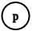

```@meta
CurrentModule = SoleLogics
```

```@contents
Pages = ["modal-logic.md"]
```

# [Introduction](@id modal-logic-introduction)
At the end of this chapter, you are going to understand what modal logic is, and why it is so important from a computational standpoint of view, with respect to propositional logic and first order logic. For those of you who want to fully immerse in the topic, we recommend reading the thesis [Foundations of Modal Symbolic Learning](https://eduardstan.github.io/assets/pdf/publications/theses/phd_thesis2023.pdf), by Stan Ionel Eduard. 

Recalling the type hierarchy presented in [man-core](@ref), it is here enriched with the following new types and structures.

- [`Connective`](@ref)
    - [`NamedConnective`](@ref)
        - [`DIAMOND`](@ref) **(new)**
        - [`BOX`](@ref) **(new)**
    - [`AbstractRelationalConnective`](@ref) **(new)**
        - [`DiamondRelationalConnective`](@ref)
        - [`BoxRelationalConnective`](@ref)
---

- [`AbstractWorld`](@ref) **(new)**
    - [`World{T}`](@ref)

---

- [`AbstractFrame{W<:AbstractWorld}`](@ref) **(new)**
    - [`AbstractUniModalFrame{W<:AbstractWorld}`](@ref)
    - [`AbstractMultiModalFrame{W<:AbstractWorld}`](@ref)
    - [`WrapperMultiModalFrame{W<:AbstractWorld, D<:AbstractDict{<:AbstractRelation,<:AbstractUniModalFrame{W}}}`](@ref)

---

- [`AbstractRelation`](@ref) **(new)**

---

- [`AbstractInterpretation`](@ref)
    - [`AbstractKripkeStructure`](@ref) **(new)**
        - [`KripkeStructure{FR<:AbstractFrame, MAS<:AbstractDict}`](@ref)


# [Pills of Modal Logic](@id modal-logic-pills)
Narrowly speaking, modal logic was initially investigated as the logic of *necessary* and *possible* truths judgments due to Aristotle's foresighted analysis of statements containing the words "necessary" and "possible".

Modal logic is, essentially, Propositional Logic enriched with a set of *modal connectives* (or *modalities*),
that are used to express some form of quantification over a set of *entities*. Interpretations in modal logic act as directed, possibly many-relation *graphs of propositional assigments*, and are called *Kripke structures*. The vertices in the graph model the entities, and are called *possible worlds* (or, simply, *worlds*). Furthermore, worlds are connected via one or more *accessibility* relations, and each world has a propositional assignment. Modal formula are, generally, interpreted on specific worlds of Kripke structures.

## [Why Modal Logic? An introduction](@id why-modal-logic)
Very often real-world applications give rise to non-static sets of data (e.g., temporal, spatial, graph-based data). The standard approach is to pre-process such data, so that their aspect becomes easy to fit in a tabular structure (e.g., datasets, spreadsheets).

Pre-processing non-static data means *denaturing it*: we want to deal with this kind of data *natively*, avoiding losing valuable information about its structure. Because of this, we require a logic which is more expressive than propositional one. This is where modal logic comes in.

Imagine the following scenario: you have a speech audio sample of $9$ seconds and you want to check whether some facts are true or false on it. 
From an abstract point of view, the sample is a single entity on which some propositional assignments are true.

We might, for example, establish whether the propositional letter $p$ is true or no on the sample, where $p$ is the fact *the audio is loud*. The latter fact is referred to the sample in its entirety: by looking at it *as a whole* we can compute whether $p$ is true or no. Let's say that $p$ is true. We can easily schematize the situation by just drawing a node containing $p$, where the node is the entire audio.



This little world can be coded roughly as follows.

```julia
world = SoleLogics.World(1) # this is just an abstract reference to a 9s audio sample
p = Atom("p") # "the audio is loud"

# ... calculations here ...

valuation = Dict([world => TruthDict(p => true)]) # after some calculations, we establish "p" is true in "world"
```

Here's the challenge. Try to express the following fact using just propositional logic: *the audio contains at least two pauses of three seconds that are interspersed with each other by three or more seconds of loud speaking*. After a few tries you should be convinced that this is not possible, because through propositional logic we are not able to *quantify over relations **inside** the sample*. What we can do instead, is considering the audio as a sorted list of sub-samples (or, more generally, a temporal series). Each sub-sample is what we defined world in [Pills of Modal Logic](@ref modal-logic-pills). 

Let's see how to deal more granularly with the original audio sample, without denaturing it. We want to establish whether the long statement in the previous paragraph is true or no. Here is what we need to define.

* an [`Atom`](@ref) $p$, representing the fact *the audio is loud*;
* an [`Atom`](@ref) $q$, repressening the fact *the audio is silence*;
* [`World`](@ref)s describing small pieces of the original audio. In particular, we establish that each world is representative for $3$ seconds of audio;
* an accessibility relation (a specific [`AbstractRelation`](@ref)) to express which worlds are reachable from another through a modal [`NamedConnective`](@ref). 

The situation is simply schematized as follows


where each world identifies $3$ seconds of audio, and we consider a relation between two worlds only if they represent adjacent parts of the audio. And now, the coding counterpart: let's create the Kripke structure represented in the example.

```julia
p = Atom("p") # "the audio is loud"
q = Atom("q") # "the audio is silence"

# Worlds representing 3-second-pieces of the original audio
worlds = [SoleLogics.World(1), SoleLogics.World(2), SoleLogics.World(3)]
edges = Edge.([(1,2), (1,3)])
kripkeframe = SoleLogics.ExplicitCrispUniModalFrame(worlds, Graphs.SimpleDiGraph(edges))

valuation = Dict([worlds[1] => TruthDict([p => false, q => true]), worlds[2] => TruthDict([p => true, q => false]), worlds[3] => TruthDict([p => false, q => true])])

kripkestructure = KripkeStructure(kripkeframe, valuation)
```
In the Kripke structure above, the second world (the only one where $p$ is true) is accessible from the first world (the one on the left, where $q$ is true). Moreover, in the second world, $p$ is true. In modal logic terms, this is expressed by the notation

$$K,w_1 \models \lozenge p$$

where $K$ is a Kripke structure, $w$ is a specific world in the Kripke structure, and $\lozenge p$ means *look at the world accessibles from w, and check whether p is true or false here*.

Now we are ready to resume the long statement of a few paragraphs ago, the one we could not express using only propositional logic. We can translate it using modal logic! The formula we are looking for is 

$$q \wedge \lozenge p \wedge \lozenge \lozenge q$$ 

which has to be read *check whether this sub-sample of audio is silence, and the sub-sample after this is loud, and the sub-sample after the latter is silence again*.

By reading the following sections, you will better grasp how [`World`](@ref)s are defined, as well as relations ([`AbstractRelation`](@ref)), how those two concepts are bound togheter in [`AbstractFrame`](@ref)s and [`KripkeStructure`](@ref)s. You will also understand how to access one world from another by using (or implementing) [`Connective`](@ref)s such as [`◊`](@ref) (or [`DIAMOND`](@ref)) and the [`accessibles`](@ref) method.

- Practical use cases examples (..., ..., ...)

- First order logic comparison


## [Worlds and Frames](@id modal-logic-worlds-and-frames)

```@docs
AbstractWorld
World{T}
```

```@docs
AbstractFrame{W<:AbstractWorld}
worldtype(::Type{<:AbstractFrame{W}}) where {W<:AbstractWorld}
allworlds(fr::AbstractFrame{W}) where {W<:AbstractWorld}
nworlds(fr::AbstractFrame)

AbstractUniModalFrame{W<:AbstractWorld}
accessibles(fr::AbstractUniModalFrame{W}, w::W) where {W<:AbstractWorld}
```

## [Relations](@id modal-logic-relations)

```@docs
AbstractRelation
arity(r::AbstractRelation)
converse(r::AbstractRelation)
istoone(r::AbstractRelation)
issymmetric(r::AbstractRelation)
isreflexive(::AbstractRelation)
istransitive(::AbstractRelation)
isgrounding(::AbstractRelation)
```

## [More on Frames and Kripke Structures](@id modal-logic-kripke-structures)

```@docs
AbstractMultiModalFrame{W<:AbstractWorld}
accessibles(fr::AbstractMultiModalFrame{W}, w::W, r::AbstractRelation) where {W<:AbstractWorld}
```

```@docs
AbstractKripkeStructure

check(φ::SyntaxTree, i::AbstractKripkeStructure, w::Union{Nothing,<:AbstractWorld} = nothing; use_memo::Union{Nothing,AbstractDict{<:Formula,<:Vector{<:AbstractWorld}}} = nothing, perform_normalization::Bool = true, memo_max_height::Union{Nothing,Int} = nothing)

KripkeStructure{FR<:AbstractFrame, MAS<:AbstractDict}
```

## [Modal Connectives](@id modal-logic-connectives)

```@docs
ismodal(::Type{<:Connective})
isbox(::Type{<:Connective})
```

```@docs
DIAMOND
BOX
```

## [Relational Connectives](@id modal-logic-relational-connectives)

```@docs
AbstractRelationalConnective{R<:AbstractRelation}
relationtype(::AbstractRelationalConnective{R}) where {R<:AbstractRelation}
DiamondRelationalConnective{R<:AbstractRelation}

diamond()
box()
```

## [Final steps](@id modal-logic-final-steps)

```@docs
modallogic(; alphabet::Union{Nothing,Vector,AbstractAlphabet} = nothing, operators::Union{Nothing,Vector{<:Connective}} = nothing, grammar::Union{Nothing,AbstractGrammar} = nothing, algebra::Union{Nothing,AbstractAlgebra} = nothing, default_operators = BASE_MODAL_CONNECTIVES)

collateworlds(fr::AbstractFrame{W}, op::Operator, t::NTuple{N,<:AbstractWorlds}) where {N,W<:AbstractWorld}
```
